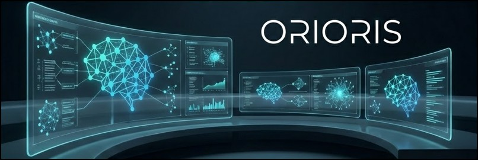
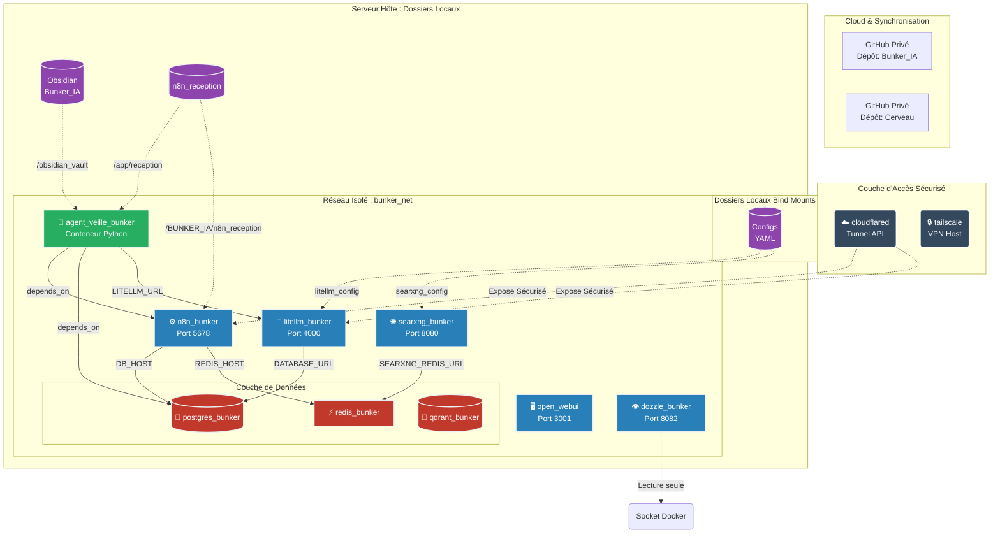
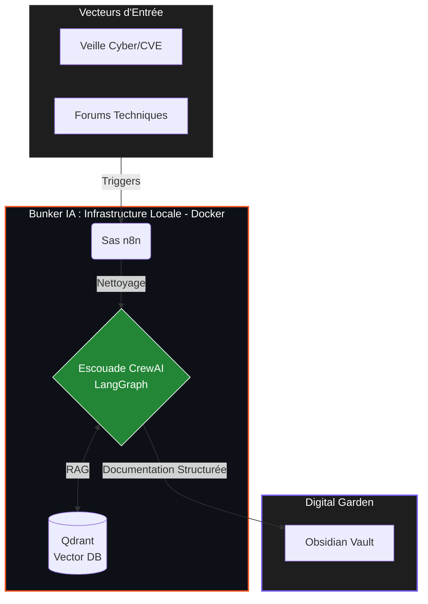

  

  <h1>ORIORIS | Architecte Système & Cybersécurité</h1>
  
  
<b>Industrialiser l'Éphémère. Protéger la Connaissance.</b>

  

    
    
    
  

<h1> 🛠️ Stack Technique</h1>
  
  
  
  
  
  

---

## 🚀 Mission : Transformer le Bruit en Intelligence Tactique

Avec 20 ans d'expérience technique et commerciale B2B, je ne code pas pour faire de la théorie. **Je conçois des écosystèmes résilients.** Ma transition vers la Cybersécurité (AIS) s'appuie sur une conviction stricte : la sécurité commence par l'isolation, et la performance par l'automatisation autonome.

### 🧠 Mon OS Personnel : L'Architecture "Bunker IA"

Je développe et maintiens un environnement local "Zero Trust" où des agents IA autonomes effectuent la veille technologique et la résolution de problèmes sans exposer de données à l'extérieur.

---

---

## 💡 Expertise
*   **Infrastructure as Code & Conteneurisation :** Architecture multi-services (PostgreSQL, Qdrant, LiteLLM) sous Docker.
*   **Ingénierie Agentique :** Développement d'agents Python avec `CrewAI` pour l'analyse et la structuration de données complexes.
*   **Passerelles IA :** Implémentation de protocoles `MCP` pour la communication inter-agents.

---

Technique-Commercial avec 20 ans d'expérience, en transition vers la **Cybersécurité**.
Je conçois et maintiens des architectures locales agentiques pour optimiser la connaissance et l'automatisation.

## 🚀 Projets & Focus
*   **Bunker IA (Privé) :** Infrastructure locale conteneurisée (Docker) orchestrant des workflows IA (RAG/Vector DB) et des agents autonomes.
*   **Veille Agentique :** Développement d'agents Python pour l'analyse de flux et la structuration de données (RAG/Qdrant).
*   **Transition AIS :** Préparation à la certification Administrateur d'Infrastructures Sécurisées.

## 📈 Objectif
Fusionner mon expertise B2B avec les nouvelles capacités de l'IA et de la Cybersécurité pour construire des systèmes résilients et sécurisés.

---
*En recherche active d'opportunités en cybersécurité / AIS pour la rentrée 2026.*
