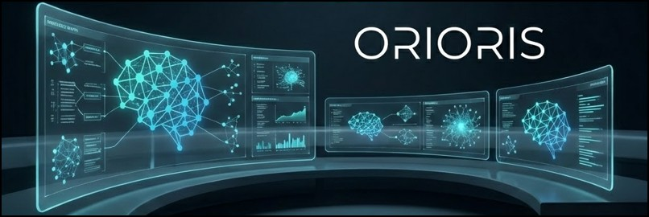
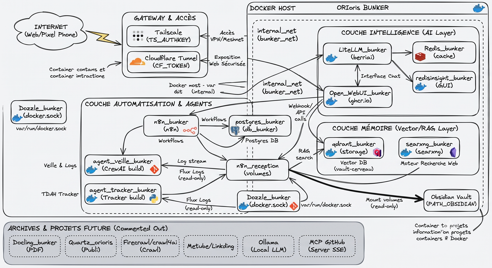
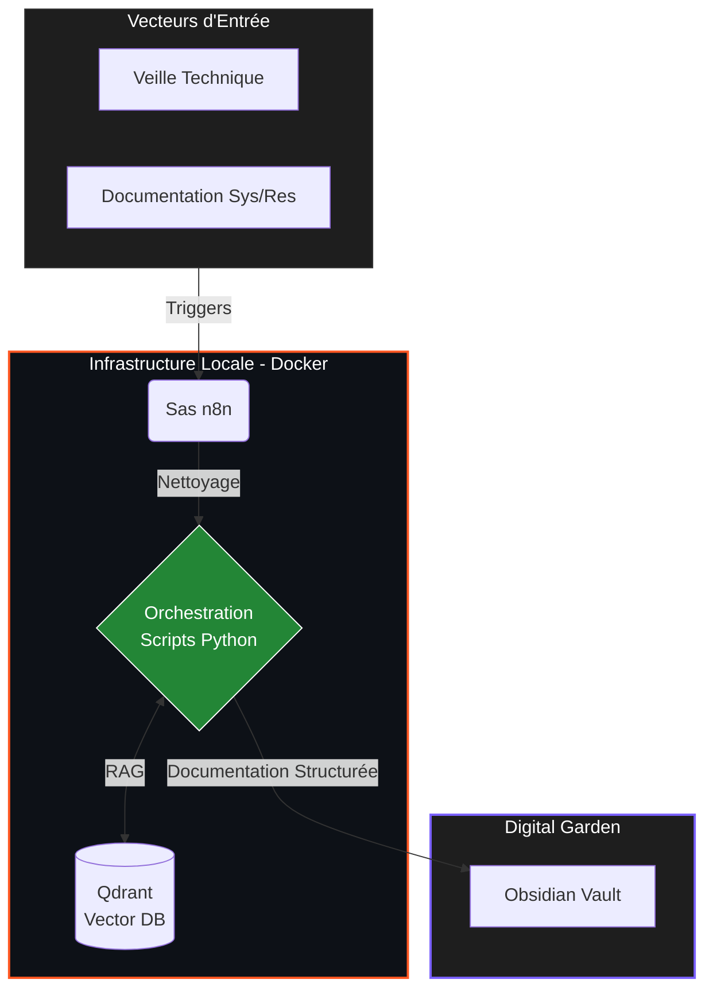

  

  <h1>ORIORIS | Systèmes, Réseaux & Automatisation</h1>
  
  
<b>Industrialiser l'Éphémère. Maîtriser l'Infrastructure.</b>

  

    
    
    
  

  
  
  
  
  
  

---

## 🚀 Mission : Transformer le Bruit en Intelligence Tactique

Avec 20 ans d'expérience technique, terrain et commerciale B2B, je ne code pas pour faire de la théorie. **Je développe des outils pour le terrain.** Ma reconversion vers le développement s'appuie sur une conviction stricte : la performance d'une entreprise passe par l'automatisation de ses processus métiers (scripts, APIs, pipelines de données).

### 🧠 Mon OS Personnel : L'Architecture "Bunker IA"

Je développe et maintiens un environnement local auto-hébergé où des flux automatisés et des agents IA effectuent la veille technologique sans exposer de données à l'extérieur. 

*(Aperçu de la topologie réseau et conteneurs)*

  

---

```mermaid
graph TD
    %% --- Inputs ---
    subgraph Acquisition [Vecteurs d'Entrée]
        A[Veille Technique]
        B[Documentation Sys/Res]
    end
    %% --- Le Bunker ---
    subgraph Bunker [Infrastructure Locale - Docker]
        C(Sas n8n)
        D{Orchestration<br>Scripts Python}
        E[(Qdrant<br>Vector DB)]        
        C -->|Nettoyage| D
        D <-->|RAG| E
    end
    %% --- Outputs ---
    subgraph PKM [Digital Garden]
        F[Obsidian Vault]
    end
    Acquisition -->|Triggers| C
    D -->|Documentation Structurée| F
    %% Styles (Dark Mode GitHub)
    style Acquisition fill:#1e1e1e,stroke:#333,color:#fff
    style Bunker fill:#0d1117,stroke:#ff5722,stroke-width:2px,color:#fff
    style PKM fill:#1e1e1e,stroke:#7b61ff,stroke-width:2px,color:#fff
    style D fill:#238636,stroke:#fff,color:#fff
```

💡 Expertise & Pratique

Systèmes & Réseaux : Routage sécurisé (Tailscale/Cloudflare), environnements Linux, gestion des ports et volumes.

Infrastructure as Code & Conteneurisation : Architecture multi-services (PostgreSQL, n8n, Serveurs web) sous Docker et Docker-Compose.

Automatisation (Dev) : Création de workflows métiers complexes (n8n), scripts d'API et interconnexion de bases de données.

Technique-Commercial et profil de terrain avec 20 ans d'expérience, en transition vers **le Développement et l'Automatisation**.
Je code et maintiens des outils locaux pour optimiser la donnée, interconnecter les systèmes et automatiser les processus métiers.

## 🚀 Projets & Focus
*   **Bunker IA (Privé) :** Infrastructure locale (Docker) orchestrant des scripts Python et des flux réseau.
*   **Développement & Automatisation :** Création de pipelines complexes (n8n, APIs) et requêtage de bases de données (PostgreSQL, Qdrant).
*   **Objectif 2026 :** Formation en alternance orientée Développement / DevOps / Automatisation logicielle.

---
*En recherche active d'une entreprise pour une alternance en Développement & Automatisation pour la rentrée 2026.*
